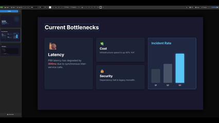

# 🎨 DeckBuilder

> **A local-first presentation editor for the AI era.**
> Bridge the gap between LLM generation and final polish. No cloud. No install. Just build.

## ⚡ Why This Exists

### The AI Workflow Problem
Most tools break the flow between generation and polish. DeckBuilder bridges that gap:

1.  **Prompt:** Ask ChatGPT/Claude to "Generate an HTML slide deck about [System Arch]..."
2.  **Paste:** Drop the raw code directly into DeckBuilder.
3.  **Polish:** Use the visual editor to fix layout anomalies and drag-and-drop assets.
4.  **Ship:** Export to PDF or save as a single HTML file.

### The Versioning Problem
Engineers shouldn't have to manage `final_v2_FINAL_revised.pptx` scattered across cloud drives.
I wanted a tool that works like an editor, not a wizard. Files I own, **diffs I can read in Git**, and no internet required.

---

## ✨ Features

* **📄 Single HTML file** — No build process, no dependencies.
* **🔒 Local-first** — Your data never leaves your device.
* **🎨 Visual Drag & Drop** — Resize, move, and layer elements freely.
* **💾 Git-Friendly** — Readable HTML diffs (minor style reorder on edits).
* **🔌 Offline Capable** — Works 100% without internet.
* **📤 PDF Export** — One-click export for sharing.

---

## 🤔 Why a Single HTML File?

**Short answer: Longevity.**

I wanted a tool that still works in 10 years without npm, build steps, or cloud services.
Most tools today have "mass"—dependencies, build chains, accounts, servers. That mass creates friction and fragility.

DeckBuilder is intentionally minimal:

| What's Missing | Why That's Good |
| :--- | :--- |
| **No npm** | Nothing to install, nothing to break. |
| **No build step** | The source *is* the app. |
| **No cloud** | Your files stay on your machine. |
| **No account** | Open the file, start working. |

> Local-first isn't just about privacy. It's about owning your tools and understanding how they break.
> **If GitHub disappears tomorrow, you still have a working editor. That's the point.**

---

## 🚀 Quick Start

**Option 1: Try Online**
[**Launch DeckBuilder Live**](https://zohaibus.github.io/deckbuilder/editor.html)

**Option 2: Download**
1.  Download `editor.html`
2.  Open in Chrome/Edge
3.  **Start building**

*No npm. No server. No account.*

---

## 🎯 Who This Is For

| User | Why DeckBuilder? |
| :--- | :--- |
| **Engineers** | You want to version control your slides like code. |
| **Architects** | You need to document systems without fighting "smart" wizards. |
| **Tech Leads** | You use AI to generate drafts and need a quick way to polish them. |

*(Not for: Marketing decks with complex animations or print-perfect design)*

---

## ⌨️ Controls & Shortcuts

| Scope | Key/Action | Result |
| :--- | :--- | :--- |
| **Actions** | `Ctrl+S` | Save |
| | `Ctrl+Z` / `Ctrl+Y` | Undo / Redo |
| | `Ctrl+D` | Duplicate selected |
| **Grouping** | `Ctrl+G` | Group selected |
| | `Ctrl+Shift+G` | Ungroup |
| **Layers** | `⬆` / `⬇` | Bring to Front / Send to Back |

**Mouse Controls:**
* **Double-click:** Edit text
* **Shift+Click:** Multi-select elements
* **Right-click:** Context menu

---

## 🌐 Browser Support

| Browser | Status | Note |
| :--- | :--- | :--- |
| **Chrome/Edge** | ✅ Perfect | Full File System Access API support. |
| **Firefox** | ⚠️ Manual | Works, but requires manual Save/Load (no direct disk write). |
| **Safari** | ⚠️ Limited | No File System API support yet. |

---

## 🛠️ Technical Details

* **Stack:** Pure HTML/CSS/JavaScript
* **Format:** Saves as standard HTML `
...
`
* **Dependencies:** Zero. None.

## License & Contributing
MIT License. Issues and PRs welcome — keep it simple, this is intentionally a single-file tool.

---
*Built by [Zohaib Usmani](https://github.com/zohaibus) — Principal Engineer solving the presentation versioning problem.*
