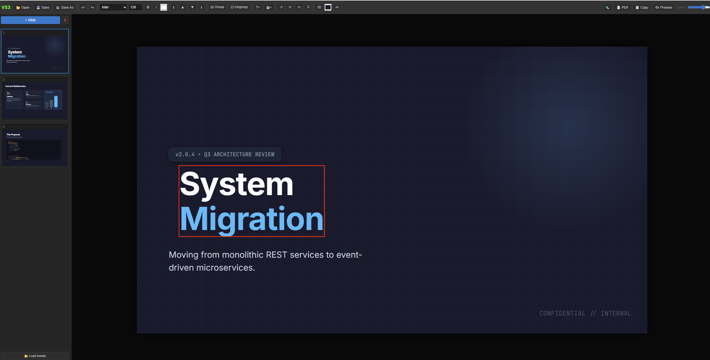

# DeckBuilder

**A local-first presentation editor in a single HTML file.**

No install. No cloud. No dependencies to manage. Just open and build.



> **[Try it live →](https://zohaibus.github.io/deckbuilder/editor.html)** (or download and run locally)

---

## Why This Exists

Most presentation tools break down under iteration speed and versioning pressure. You end up with `final_v2_FINAL_revised.pptx` scattered across cloud drives.

I wanted a presentation tool that works like an editor, not a wizard. Files I own, diffs I can read, and no internet required.

---

## Who This Is For

- Engineers explaining systems
- Architects documenting designs
- Technical leaders preparing reviews
- Anyone who wants to version control their slides

## Who This Is NOT For

- Marketing decks with animations
- Real-time collaboration workflows
- Pixel-perfect print design

---

## Design Philosophy

- **Local-first** - Your files, your machine
- **Files over platforms** - No account, no cloud lock-in
- **Deterministic output** - Same input, same output
- **Readable diffs** - HTML that makes sense in git

---

## Features

- **Single HTML file** - Everything in one portable file
- **Visual drag & drop** - Resize, move, layer elements freely
- **Git-friendly** - HTML diffs cleanly (minor style reorder on edits)
- **Local-first** - Works completely offline, saves to your machine
- **PDF export** - Good for sharing, one-click export
- **Zero dependencies** - No npm, no build step, no frameworks

## Quick Start

**Option 1: Try Online**  
Visit [zohaibus.github.io/deckbuilder](https://zohaibus.github.io/deckbuilder/editor.html)

**Option 2: Download**
1. Download `editor.html`
2. Open in Chrome/Edge
3. Start building

Or use the launchers: `START.bat` (Windows) / `START.command` (Mac) / `start.sh` (Linux)

---

## Keyboard Shortcuts

| Key | Action |
| --- | --- |
| `Ctrl+S` | Save |
| `Ctrl+Z` | Undo |
| `Ctrl+Y` | Redo |
| `Ctrl+G` | Group selected |
| `Ctrl+Shift+G` | Ungroup |
| `Ctrl+D` | Duplicate |
| `Delete` | Delete selected |
| `Escape` | Deselect |

## Editing

- **Click** to select element
- **Double-click** to edit text
- **Shift+Click** to multi-select
- **Drag edges** to resize
- **Right-click** for context menu

## Layer Controls

| Button | Action |
| --- | --- |
| ⬆ | Bring to front |
| ▲ | Bring forward |
| ▼ | Send backward |
| ⬇ | Send to back |

---

## File Format

Saves as standard HTML. Open in any browser, edit in any text editor, version in Git.

```html
<div class="slide-container">
  <h1 style="position:absolute; left:100px; top:200px;">
    Your Content
  </h1>
</div>
```

## Browser Support

| Browser | Status |
| --- | --- |
| Chrome | ✅ Full support |
| Edge | ✅ Full support |
| Firefox | ⚠️ Limited (no File System API) |
| Safari | ⚠️ Limited (no File System API) |

---

## License

MIT License - see [LICENSE](LICENSE)

## Contributing

Issues and PRs welcome. Keep it simple, this is intentionally a single-file tool.

---

*This project was developed independently and is not affiliated with any employer.*